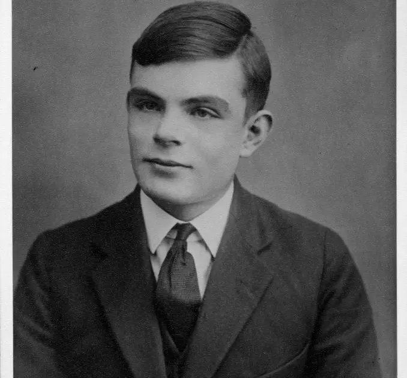

# 🚀 Projeto Sequencial 1/3 — Máquina de Turing

  
  
  
  

  
  

---

## 📌 Contextualização

Projeto proposto pelo **Programadores do Amanhã**, no formato **CodeLab**, com **sprints semanais**, *code review*, feedbacks contínuos e dicas de melhoria.  
O acompanhamento foi realizado por um profissional especialista em **desenvolvimento web e programação**, com atuação como **Tech Lead** e experiência em **liderança de projetos e equipes**.

---

## 🧠 O que é a Máquina de Turing?

  

Em **1936**, a Máquina de Turing foi proposta por **Alan Mathison Turing**, renomado **matemático, cientista da computação e criptoanalista britânico**.  
Turing teve papel fundamental durante a **II Guerra Mundial**, atuando no **Government Code and Cypher School**, em Buckinghamshire, onde contribuiu para o desenvolvimento do **Colossus**, um dos primeiros computadores digitais programáveis.

Antes do fim de sua vida (**23 de junho de 1912 – 7 de junho de 1954**), também participou do projeto **ACE (Automatic Computing Engine)**, que influenciou fortemente a arquitetura dos computadores modernos.

  

A **Máquina de Turing** é um **modelo abstrato de computação** que teve grande impacto no desenvolvimento da **lógica matemática** e da **ciência da computação teórica**.  
Ela surgiu no contexto dos debates sobre a **decidibilidade matemática**, isto é, a investigação sobre a existência de um algoritmo capaz de determinar se uma afirmação pode ser derivada de um conjunto de axiomas.

Em seu artigo, Turing demonstrou que a chamada **“automatic machine”** (ou **“a-machine”**) seria capaz de:

- Ler, escrever e apagar símbolos binários  
- Operar sobre uma fita de comprimento ilimitado  
- Mover uma cabeça de leitura e gravação para a esquerda ou direita  
- Executar instruções simples definidas por estados da máquina  

Cada regra aplicada define o que se convencionou chamar de **estado da máquina**.

> “A Máquina de Turing era a resposta de Alan Turing à questão metamatemática de Hilbert.  
> Turing estabeleceu um modelo formal de algoritmo e, pouco depois, Church proporia que qualquer procedimento efetivo poderia ser realizado por uma Máquina de Turing (Tese de Church).  
> Em outras palavras, qualquer processo que aceitamos como um algoritmo é precisamente o que uma Máquina de Turing pode executar.”  
>
> **Pozza, Osvaldo Antonio; Penedo, Sérgio**  
> Universidade Federal de Santa Catarina (UFSC)

---

## ⚙️ Processo de Desenvolvimento

O projeto foi desenvolvido ao longo de uma **sprint de 10 dias**, período no qual foram revisados conceitos fundamentais de:

- Algoritmos  
- Pseudocódigo  
- JavaScript  

Para organizar o desenvolvimento, foi criado um **esquema visual no draw.io**, centralizando:

- Objetivos e requisitos  
- Planejamento da sprint  
- Rascunhos de código  
- Exemplos práticos  
- Checklist final  

  

---

## 🛠️ Tecnologias Utilizadas

- **JavaScript**
- **Algoritmos**
- **Pseudocódigo**
- **Markdown**
- **Draw.io**
